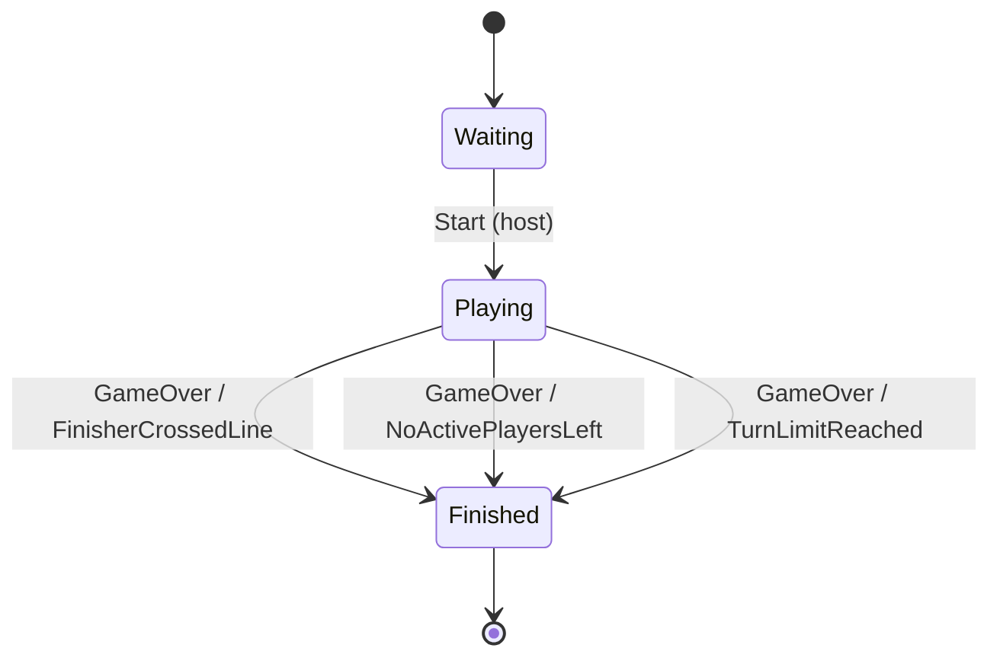
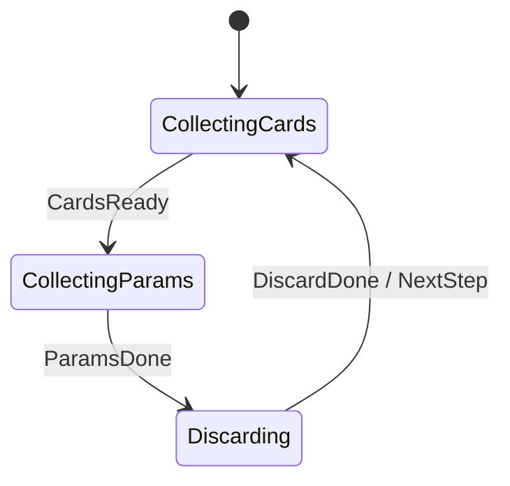

# Toko

Racing board game web app built with **.NET 9 API + Blazor WebAssembly**.  

<hr />
<p align="center">
  <a href="https://github.com/user-attachments/assets/696b516c-eb83-4553-ba86-8cb590ac77d3">
    
  </a>
  <a href="https://github.com/user-attachments/assets/25d9ad77-2f6c-487c-a074-43b98a877bec">
    
  </a>
</p>

> **Just-for-fun**  
> Built in my spare time for learning and experimentation. Feel free to clone, tinker, and break things—just don’t ship it to production.

## Quick Start

The simplest way to run the entire application is with Docker.  

**0. Clone the repo**
```bash
git clone https://github.com/wyh2001/Toko.git
cd Toko
```

**1. Set JWT Secret Key**

Set the required secret key for signing JWTs. The key must be at least 32 bytes long.

For your **current terminal session**, run:

```bash
export Jwt__Key=$(openssl rand -base64 48)
```

**2. Run with Docker Compose**

```pwsh
docker compose up --build
```

The application will be available at `http://localhost:8080`.


<details>
<summary><strong>Full environment variable reference</strong></summary>

| Variable | Required | Default (compose) | Purpose |
|----------|----------|-------------------|---------|
| `Jwt__Key` | Yes | (none) | Symmetric signing key (>=32 chars) for JWT. |
| `Jwt__Issuer` | No | (unset) | Issuer claim; enables issuer validation when set. |
| `Jwt__Audience` | No | (unset) | Audience claim; enables audience validation when set. |
| `TRUST_FORWARDED_HEADERS` | No | true | Trust X-Forwarded-* (clears KnownNetworks/Proxies if true). |
| `FORCE_SECURE_COOKIE` | No | false | Force `Secure` on auth cookie (use true in prod behind TLS). |
| `ReverseProxy__ApiAddress` | For web host | http://toko:8080 | YARP upstream API base URL. |

Guidance:
* Set `TRUST_FORWARDED_HEADERS=false` if directly exposed (no reverse proxy).
* Set `FORCE_SECURE_COOKIE=true` when site is served over HTTPS (or behind TLS terminator).
* Adjust `ReverseProxy__ApiAddress` if service name/port differ in custom compose or Kubernetes.

</details>

## Technology Stack

*   **Backend:** .NET 9, ASP.NET Core Web API, SignalR (real-time communication), JWT Bearer authentication.
*   **Frontend:** Blazor WebAssembly client served through ASP.NET Core host with YARP reverse proxy.

**Supporting libraries**
* **Stateless** – Game state machine enforcing valid transitions.
* **OneOf** – Explicit success/error union results.


## Core Concepts

<details open>
<summary><strong>1. Game Logic as a State Machine</strong></summary>

The game runtime is governed by two concrete finite state machines defined in `Room`:

1. A top-level game FSM (`RoomStatus` + `GameTrigger`)
2. A phase (round step) FSM (`Phase` + `PhaseTrigger`) that is activated only while playing

Game-level lifecycle:  



Phase cycle (active only inside `Playing`):



</details>

<details>
<summary><strong>2. Cheat Prevention with Anonymous JWTs</strong></summary>

To secure game actions without requiring users to register or log in, the system uses persistent JWTs.

1.  **First visit:** The client calls the auth endpoint; the server generates a JWT and returns it (via an HttpOnly cookie) bound to that player.
2.  **Subsequent requests:** The browser automatically sends the HttpOnly `token` cookie with every same-site API call.
3.  **Backend validation:** The JWT bearer middleware (see `Program.cs` `OnMessageReceived`) extracts the token from the cookie and validates signature, (optional) issuer/audience, lifetime, then associates the player (subject claim) with the request. Game logic then additionally checks turn ownership to block out‑of‑turn or impersonated actions.

</details>

<details>
<summary><strong>3. Predictable, Type-Safe Error Handling</strong></summary>

Inspired by patterns from other modern languages, the API avoids throwing exceptions for predictable domain errors. Instead, it returns strongly-typed result objects.

When an action fails for an expected reason (e.g., "It's not your turn," "The selected move is invalid," or "The game is already full"), the API returns a specific error type. This is achieved using the `OneOf` library, which allows a single endpoint to return a union of possible types (e.g., `Success | NotYourTurn | RoomNotFound`).

This forces the client to handle known failure scenarios explicitly, leading to a more robust and predictable user experience, and avoids polluting the server with exception-handling logic for non-exceptional situations.

</details>

## Next Steps

* Persistence storage for saving rooms, replay, auditing.
* No big new features in the future.
* Plan is to extract a standalone, pluggable .NET board game engine for different variants.

## License

Code: MIT License (see `LICENSE`).  

Kenney "Racing Pack" assets are CC0 1.0 Universal (Public Domain Dedication).
